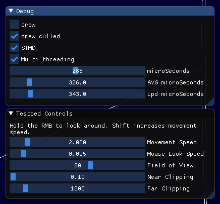
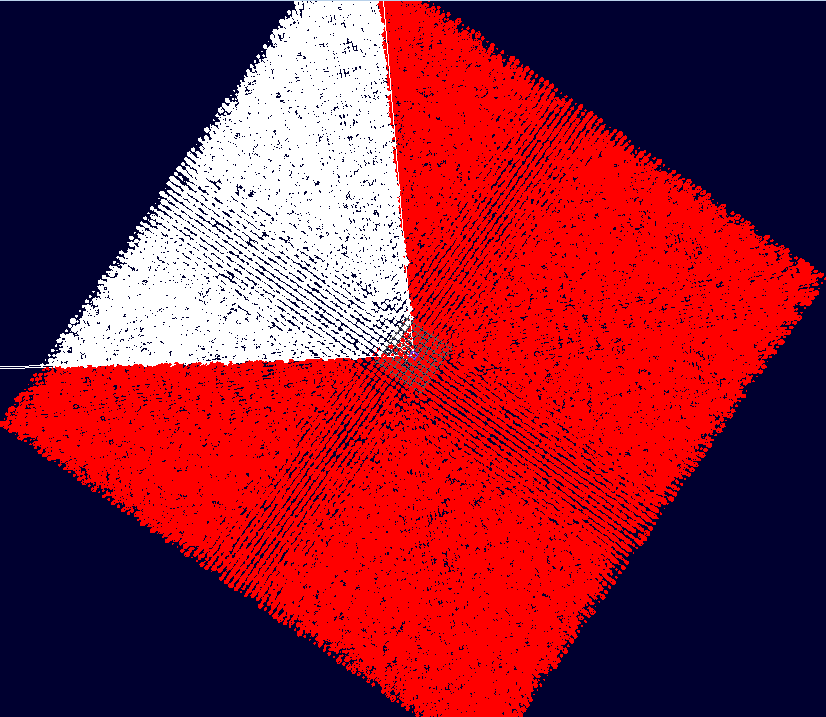

Currently about 3~6x faster than our closest competitor.

Expected throughput on modern hardware: 2000 sphere/planes tests per µs (SIMD+MT).

Measured throughput on slowest hardware tested: 400 culls/µs on a 2007 2.66GHz Conroe (C2D E6750).

Drawing is just to visualize that the program is correct. It's not optimized.

